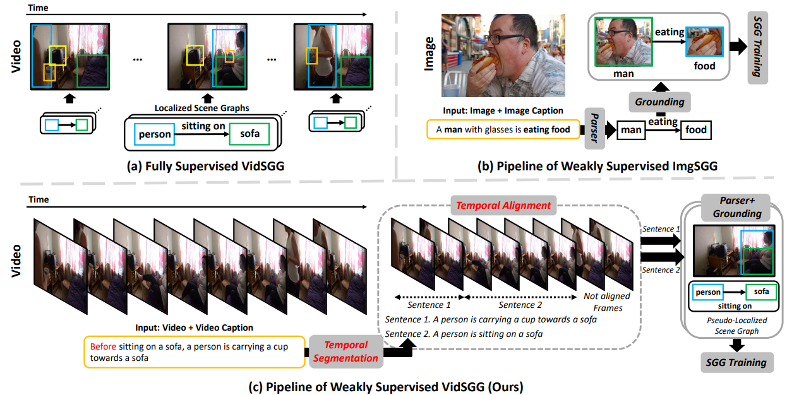

# Weakly Supervised Video Scene Graph Generation with Natural Language Supervision  


The official source code for [Weakly Supervised Video Scene Graph Generation via Natural Language Supervision](https://openreview.net/pdf?id=GQgPj1H4pO), accepted at [ICLR 2025](https://iclr.cc/).


## **Overview**    

  

As shown in Fig.(a), existing Video Scene Graph Generation (VidSGG) studies are trained in a fully supervised manner, which requires all frames in a video to be annotated, thereby incurring high annotation cost compared to Image Scene Graph Generation (ImgSGG). To alleviate it, we aim to train VidSGG models with natural language (i.e., video captions), shown in Figure (c). Compared to weakly supervised ImgSGG (Figure (b)), it is necessary to consider two key factors: **1) Temporality within Video Captions** and **2) Variability in Action Duration**.

* **Temporality within Video Captions**: Contrary to image captions shown in Fig.(b), video captions often contain temporal markers (e.g., *before*, *while*, *then*, *after*) representing time-related details. Without considering them, the VidSGG models may erroneously be supervised, resulting in deteriorating the performance.

* **Variability in Action Duration**: Human actions unfold over varying duration in a video. Likewise, without considering it, the VidSGG models may erroneously be supervised.


### Proposed Framework: **NL-VSGG**

To train the VidSGG models with only readily available video captions, we propose a simple yet effective framework, called weakly supervised **V**id**S**GG with **N**atural **L**anguage **S**upervision (**VSNLS**). To consider aforementioned two key factors, **VSNLS** consists of two key modules: Temporality-aware Caption Segmentation (TCS) module, and Action Duration Variability-aware Caption-Frame Alignment (ADV) module.

*To the best of our knowledge, we are the first to train the VidSGG models with natural language supervision*.


##  **TODO List**  

- [x] Implement NL-VSGG on NVIDIA GeForce A6000 (48GB).
- [ ] Implement NL-VSGG on Intel Gaudi-v2.


##  **Installation**  

Please refer to following [INSTALL.md](GUIDELINE/INSTALL.md)  

##  **Datasets**  

Please refer to following [DATASET.md](GUIDELINE/DATASET.md)  
  
## **Feature Extraction**

Following [PLA](https://github.com/zjucsq/PLA?tab=readme-ov-file), we extract object features using [VinVL](https://github.com/pzzhang/VinVL) in advance. Please download pre-trained VinVL either [link 1](https://github.com/pzzhang/VinVL) or [link 2](https://drive.google.com/drive/folders/1Bap8Sp1tfV4MDcuJ517DADWcy0cvxSEY?usp=sharing). Then, put it on *models/vinvl* directory.  

Based on VinVL object detector, extract object features.

``` python  
python VSNLS/data_preprocess/extract_bbox_features_ag.py train
python VSNLS/data_preprocess/extract_bbox_features_ag.py test
```


##  **Method**

#### Utilization of ChatGPT  

We use ChatGPT to split video captions and extract triplets based on split captions. To this end, please insert openapi key obtained from [https://platform.openai.com/account/api-keys](https://platform.openai.com/account/api-keys)

### 1. TCS module  

Given the video captions *datasets/AG/Charades_v1_train.csv*, we split video captions via [ChatGPT](https://openai.com/chatgpt).  

``` python  
python VSNLS/TCS.py {API_KEY}
```  
*  You can download the results of the TCS module in [split_action_dict.pkl](https://drive.google.com/file/d/1s1BD0_7xHRxojCT2NI4R5hCYA6N8h1fs/view?usp=sharing).

### 2. Triplet Extraction  

Following [LLM4SGG](https://github.com/rlqja1107/torch-LLM4SGG?tab=readme-ov-file#triplet-extraction-process-via-llm---vg), we extract triplets via LLM. We slightly revise prompt suitable for VidSGG.  

``` python  
python VSNLS/extract_triplet.py {API_KEY}
```  
*  You can download the results of the extracted triplets in [triplets_LLM4SGG.pkl](https://drive.google.com/file/d/1m0CyEWw1dBve6AKuHOCuzKt9dGp_6N64/view?usp=sharing).  

### 3. ADV module  

Based on split sentences in [TCS](#1.-TCS-module) module and parsed triplets in [Triplet Extraction](#2.-Triplet-Extraction), we align them via [DAC](https://github.com/SivanDoveh/DAC?tab=readme-ov-file).

``` python  
python VSNLS/ADV.py
```  

*  You can download the results of the ADV module in [semi_final_ag_data.pkl](https://drive.google.com/file/d/1gLnphPSSn-1XoOt2w5ok6dusMCyV8bLK/view?usp=sharing), [final_ag_data.pkl](https://drive.google.com/file/d/1BvpcG8-8yTwXuis5sLmakHyaMfoApryG/view?usp=sharing).  


### 4. Pseudo-labeling Negative Action Classes  

We assign negative classes (i.e., `not contacting` and `not looking at`) using motion cues.  

``` python  
python VSNLS/Assign_negative_classes.py
```  

*  You can download the results of final processed files in [final_ag_data_w_neg.pkl](https://drive.google.com/file/d/1hWtHDN7kHMIyB3KQmq26eaiftbNW7Hhh/view?usp=sharing).


### 4. Train SGG model  

To train the model, you need `final_ag_data_w_neg.pkl` and `semi_final_ag_data.pkl` files.

#### STTran

``` python  
python tools/train_STTran.py
```

#### DSG-DETR

``` python  
python tools/train_DSG_DETR.py
```

### Test  

#### STTran

``` python  
python tools/test_STTran.py --model_path {model_path}
```


#### DSG-DETR  

``` python  
python tools/test_DSG_DETR.py --model_path {model_path}
```


## **Acknowledgement**   

The code is developed on top of [PLA](https://github.com/zjucsq/PLA), [STTran](https://github.com/yrcong/STTran/tree/main), and [DSG-DETR](https://github.com/Shengyu-Feng/DSG-DETR).     